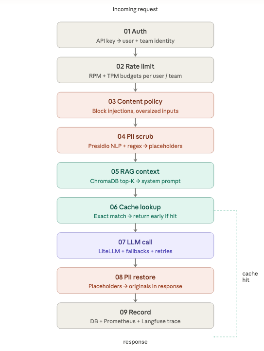

# Relay

[](LICENSE)
[](helm/relay)
[](docs/configuration.md)
[](docs/configuration.md)

Open source AI gateway with RAG, PII scrubbing, and usage controls.
Drop-in OpenAI & Anthropic compatible. Deploy to Kubernetes in minutes.

## Features

- **Multi-provider** — OpenAI, Anthropic, Azure OpenAI,
  and [any LiteLLM-supported provider](https://docs.litellm.ai/docs/providers)
- **OpenAI-compatible** — `/v1/chat/completions`, `/v1/responses`, and `/v1/embeddings`; existing tools work without
  modification
- **Responses API** — typed items, streaming events, tools, reasoning, structured outputs, and privacy-safe storage defaults
- **Anthropic Messages API** — native `/v1/messages` endpoint so Claude Code and the Anthropic SDK connect without any
  adapter; full tool use and streaming support
- **One key mode** — add your LLM provider key once, then log in and receive a Relay API key to use across all tools
- **Optional passthrough key mode** — explicitly enable BYOK for trusted deployments; disabled by default because it
  bypasses Relay identity and persistent accounting
- **PII scrubbing** — strips personal data from requests before they leave your network using Microsoft Presidio (
  NLP-based) and custom regex patterns; restores placeholders in responses
- **ACL-aware RAG / internal knowledge base** — API-key scopes restrict which repositories can contribute context;
  ChromaDB vector search with AST-aware chunking for 15+ languages (tree-sitter)
- **Code review** — sync GitHub and GitLab repositories into the knowledge base; when you send a diff for review,
  Relay automatically injects relevant context from the indexed codebase so the model can reason about your actual
  conventions, patterns, and dependencies
- **Usage and audit tracking** — authenticated Relay-key requests are durably logged with model, tokens, cost, latency,
  policy metadata, and user identity
- **Credential lifecycle** — scoped key inventory, immediate revocation, atomic rotation, and lifecycle audit events
- **Prometheus metrics** — request count, latency, token usage, cost, cache hits, PII events, RAG hits, and rate limit
  events
- **Rate limiting** — user RPM plus user/team TPM and daily budgets; atomic Redis enforcement across replicas
- **Response caching** — exact-match cache via LiteLLM (local or Redis); `X-Cache-Hit: true` header on cache hits
- **Model fallbacks** — automatic failover to backup models on errors or context-window overflow
- **Policy routing** — versioned capability policies, deployment aliases, team overrides, and auditable decisions
- **OpenTelemetry** — optional OTLP traces correlated with Langfuse and routing metadata
- **OIDC SSO** — provider discovery for Entra ID, Okta, Keycloak, Auth0, and other OpenID Connect providers
- **Evaluation harness** — compare deployment aliases using JSONL cases, deterministic graders, latency, and token reports
- **Content policy** — blocks prompt-injection patterns and oversized inputs
- **Langfuse analytics** — optional per-request LLM tracing with user IDs, session grouping, and cost
- **Admin API** — manage users, teams, and API keys; pull usage reports

Secure defaults disable BYOK passthrough, browser CORS, and API documentation; protect `/metrics` with the master key;
and require explicit `chat`, `responses`, `embeddings`, and `rag:*` capabilities on Relay-issued keys.

## Why Relay

|                          | Relay | LiteLLM Proxy | Portkey | OpenRouter |
|--------------------------|:-----:|:-------------:|:-------:|:----------:|
| Self-hosted              |   ✅   |       ✅       |    ❌    |  ❌         |
| OpenAI compatible        |   ✅   |       ✅       |    ✅    |     ✅      |
| Anthropic compatible     |   ✅   |       ✅       |    ✅    |     ✅      |
| RAG / internal knowledge |   ✅   |       ❌       |    ❌    |     ❌      |
| Code review w/ RAG       |   ✅   |       ❌       |    ❌    |     ❌      |
| PII scrubbing            |   ✅   |       ❌       |    ❌    |     ❌      |
| SSO                      |   ✅   |       ❌       |    ❌    |     ❌      |
| Per-user rate limiting   |   ✅   |       ✅       |    ✅    |     ❌      |
| Kubernetes Helm chart    |   ✅   |       ✅       |    ❌    |     ❌      |
| MIT license              |   ✅   |       ✅       |    ❌    |     ❌      |

---

## Quick start

```bash
helm install relay oci://ghcr.io/geeper-io/charts/relay \
  --namespace relay --create-namespace \
  --set secrets.openaiApiKey=sk-... \
  --set secrets.anthropicApiKey=sk-ant-... \
  --set postgresql.auth.password=your-db-password
```

The proxy is now available. Point any OpenAI-compatible tool at it — change one line:

```bash
# OpenAI SDK / curl
export OPENAI_BASE_URL=https://relay.internal/v1

# Anthropic SDK
export ANTHROPIC_BASE_URL=https://relay.internal

# Claude Code
export ANTHROPIC_BASE_URL=https://relay.internal
export ANTHROPIC_AUTH_TOKEN=gr-...
```

Your existing code works without any other changes. Get your `gr-...` key by logging in at
`https://relay.internal/auth/login` (OIDC or legacy Google SSO) or ask your admin to issue one.

---

## Request pipeline

Every request passes through 9 stages in order:



---

## Kubernetes (Helm)

The chart is published to GHCR as an OCI artifact. Requires Helm ≥ 3.8 and a cluster with a default StorageClass. `PROXY_MASTER_KEY` is auto-generated on first install and preserved across upgrades.

```bash
helm install relay oci://ghcr.io/geeper-io/charts/relay --version <version>
```

For production values, scaling, and secret management see [docs/helm.md](docs/helm.md).

---

## Docker

```bash
cp .env.example .env  # fill in keys

# Build and start everything
docker compose -f docker/docker-compose.yml up -d

# Run standalone (SQLite, no Postgres required)
docker build -t relay .
docker run --rm -p 8000:8000 \
  -e OPENAI_API_KEY=sk-... \
  -e PROXY_MASTER_KEY=secret \
  -v $(pwd)/chroma_data:/app/chroma_data \
  -v $(pwd)/knowledge_base:/app/knowledge_base \
  relay
```

Services started by compose: `proxy` (port 8000), `postgres`, `prometheus` (port 9090).

**Worker count** defaults to 4. Override with `-e WORKERS=8` or set `WORKERS=8` in `.env`.

---

## Development

```bash
pip install -r requirements-dev.txt

# Run tests
pytest

# Run with auto-reload
uvicorn app.main:app --reload --port 8000

# Disable RAG and PII for faster local iteration
RAG__ENABLED=false PII__ENABLED=false uvicorn app.main:app --reload
```

Tests use SQLite in-memory and skip RAG by default. PII tests require a spaCy model (
`python -m spacy download en_core_web_sm`).

---

## Further reading

- [Configuration reference](docs/configuration.md) — LLM providers, routing policies, PII, RAG, repo sync / code
  review, rate limiting, caching, content policy, OIDC, OpenTelemetry, and Langfuse
- [Helm reference](docs/helm.md) — production values, scaling, secret management
- [Admin API](docs/admin-api.md) — user/key management, usage reports, leaderboards, knowledge base management,
  Prometheus metrics
