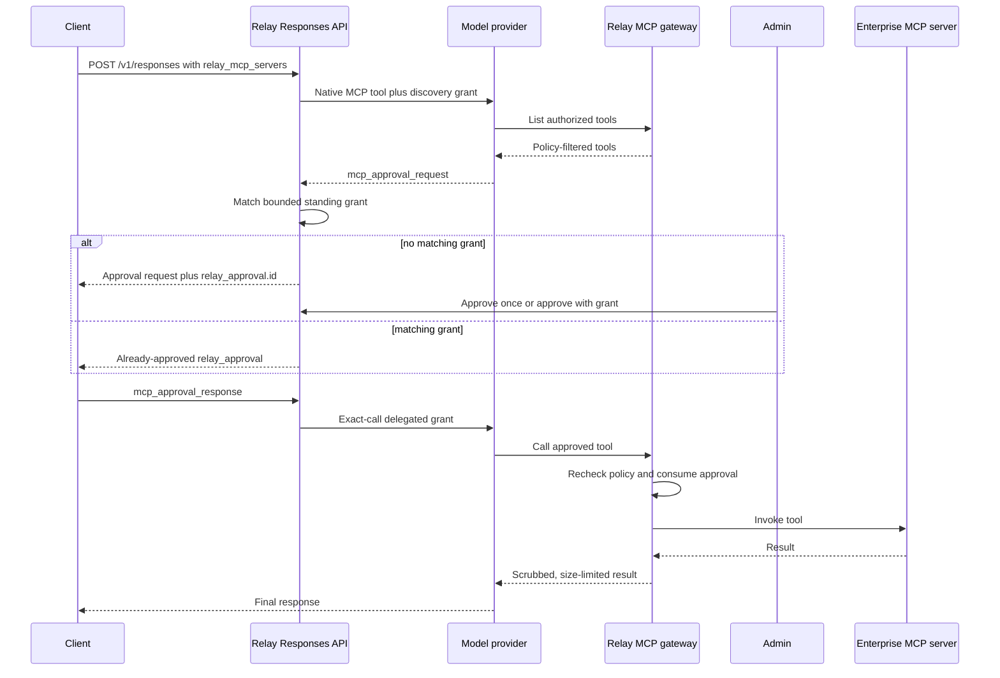

# Responses API with Relay MCP

Relay can expose configured enterprise MCP servers to models through `POST /v1/responses`. Relay remains the
authorization boundary: the model provider receives a short-lived delegated credential, while tool visibility,
argument constraints, human approvals, output scrubbing, auditing, and replay protection stay under Relay control.

The implementation follows OpenAI's
[remote MCP tool and approval protocol](https://developers.openai.com/api/docs/guides/tools-connectors-mcp).

## Request flow



Tools whose Relay policy action is `allow` can run without the human-approval pause. Tools marked
`require_approval` use the complete pause/resume flow above. Denied tools are not published to the model.

## Prerequisites

- Relay MCP is enabled and has at least one remote Streamable HTTP server.
- `mcp.public_url` points to Relay's provider-reachable `POST /mcp` endpoint. Production URLs must use HTTPS.
- The model deployment supports the `responses`, `tools`, `tool:mcp`, and `stateful` capabilities.
- The caller's Relay key has both `responses` and an appropriate MCP scope:
  `mcp:*`, `mcp:<server>:*`, or `mcp:<server>:<tool>`.
- The provider is configured for Responses API storage because the current continuation flow requires `store: true`.

Example configuration:

```yaml
mcp:
  enabled: true
  public_url: "https://relay.example.com/mcp"
  delegated_grant_ttl_seconds: 300
  approval_ttl_seconds: 900
  active_policy_version: "2026-07-30"
  servers:
    code:
      url: "https://code-tools.internal/mcp"
      description: "External sandbox execution service"
      headers_env:
        Authorization: CODE_MCP_AUTHORIZATION
  policies:
    "2026-07-30":
      default_action: deny
      rules:
        - name: safe-tests
          server: code
          tool: "test_*"
          action: allow
        - name: reviewed-execution
          server: code
          tool: execute
          action: require_approval
          constraints:
            allowed_values:
              runtime: [python, node]
            denied_patterns:
              command: ["rm\\s+-rf", "sudo"]
          grant:
            subject: user
            ttl_seconds: 28800
            max_calls: 20
            constraints:
              allowed_values:
                runtime: [python]
```

MCP server credentials remain server-side. `headers_env` values are resolved by Relay when it calls the enterprise MCP
server and are not included in model-provider requests.

## Start a response

`relay_mcp_servers` and `relay_mcp_purpose` are Relay extensions to the OpenAI-compatible request body.

```bash
curl https://relay.example.com/v1/responses \
  -H 'Authorization: Bearer gr-RELAY_KEY' \
  -H 'Content-Type: application/json' \
  -d '{
    "model": "general",
    "input": "Run the unit tests and summarize any failures",
    "store": true,
    "stream": false,
    "relay_mcp_servers": ["code"],
    "relay_mcp_purpose": "Validate pull request 184"
  }'
```

Relay discovers the selected servers, removes tools the caller cannot use, and maps the remaining tools to names such
as `code__execute`. It sends the provider a temporary `grmcp-...` credential scoped only to the selected servers. The
credential is never returned in the API response.

If the model selects a protected tool, the response contains a standard `mcp_approval_request` plus Relay metadata:

```json
{
  "id": "resp_123",
  "output": [
    {
      "id": "mcpr_123",
      "type": "mcp_approval_request",
      "server_label": "relay",
      "name": "code__execute",
      "arguments": "{\"runtime\":\"python\",\"command\":\"pytest\"}",
      "relay_approval": {
        "id": "b72c8f76-1f51-4e47-9e55-884f58a7db41",
        "status": "pending"
      }
    }
  ]
}
```

Persist both `resp_123` and `mcpr_123`; the continuation must contain the matching pair.

## Decide the Relay approval

Approval administration uses `PROXY_MASTER_KEY`, not a user Relay key.

For interactive review, enable the [admin dashboard](admin-dashboard.md) and open `/admin`. It shows the exact tool,
arguments, requester, purpose, policy version, and expiry with approve-once and deny actions. The API flow below remains
available for automation and break-glass operations.

List pending approvals:

```bash
curl 'https://relay.example.com/internal/mcp/approvals?status=pending' \
  -H 'Authorization: Bearer ADMIN_MASTER_KEY'
```

Approve:

```bash
curl -X POST \
  https://relay.example.com/internal/mcp/approvals/b72c8f76-1f51-4e47-9e55-884f58a7db41/decision \
  -H 'Authorization: Bearer ADMIN_MASTER_KEY' \
  -H 'Content-Type: application/json' \
  -d '{"decision":"approved","reason":"Command is limited to the test suite"}'
```

To reject it, send `{"decision":"denied","reason":"..."}`. A caller can also decline the proposed call by sending
an MCP approval response with `approve: false`; Relay records that pending approval as denied.

### Avoiding an approval pause on every call

Relay supports durable standing grants for reviewed, repeated workflows. A grant is bounded by user or team, exact MCP
server, glob-style tool pattern, active policy version, expiry, maximum call count, and optional argument constraints.
It never bypasses the caller's current MCP scopes or an active policy denial.

There are two ways to create one:

- Add `grant` to a `require_approval` policy rule, as in the configuration above. The first manual approval displays
  the proposed scope and creates the grant atomically with the approval decision.
- Have an admin create a grant in the dashboard or through `POST /internal/mcp/grants`; see the
  [admin API](admin-api.md#mcp-approval-grants).

An unconstrained matching grant makes the tool automatic during discovery, so the provider does not pause. A
constrained grant remains approval-marked until exact arguments are known; Relay then consumes the matching grant and
marks its approval record approved without an administrator. The client still sends the standard Responses
`mcp_approval_response` continuation, but it can do so immediately.

Relay reserves one grant call before contacting the enterprise tool. Failed remote calls therefore consume budget.
Admins can revoke a grant immediately, and a new active policy version prevents old grants from matching.

## Continue the response

After the Relay approval is approved, send the provider approval response through Relay:

```bash
curl https://relay.example.com/v1/responses \
  -H 'Authorization: Bearer gr-RELAY_KEY' \
  -H 'Content-Type: application/json' \
  -d '{
    "model": "general",
    "previous_response_id": "resp_123",
    "store": true,
    "input": [{
      "type": "mcp_approval_response",
      "approval_request_id": "mcpr_123",
      "approve": true
    }]
  }'
```

If the administrator has not decided yet, Relay returns HTTP `409` with error type `approval_required`. Clients can
retry the same continuation after approval. A denial, expiry, revoked MCP scope, changed arguments, or changed policy
version returns HTTP `403`.

Relay currently accepts one MCP approval response per continuation.

## Security properties

- The caller's long-lived `gr-...` key is never shared with the model provider.
- Discovery grants expire quickly and contain only MCP scopes for explicitly selected servers.
- After approval, Relay issues a grant restricted to one server, tool, arguments hash, caller, and approval record.
- Relay re-evaluates current scopes and the active policy when the continuation and tool call arrive.
- A policy-version change invalidates an approval created under the previous version.
- The durable approval is consumed before the enterprise tool is called, preventing replay.
- Standing grants are subject-, server-, tool-pattern-, policy-, expiry-, constraint-, and call-budget-bound; creation,
  consumption, exhaustion, and revocation are auditable.
- Tool arguments are validated against the remote JSON Schema and Relay policy constraints.
- Tool results are size-limited and PII-scrubbed before returning to the model provider.
- Approval requests, decisions, consumption, tool calls, failures, and argument hashes are written to the audit log.

The delegated credential is a bearer secret for its short lifetime. Keep Relay's `/mcp` endpoint HTTPS-only, do not
log authorization headers, and keep `delegated_grant_ttl_seconds` as short as provider latency permits.

## Current limitations

- `store: true` is required; Relay-owned stateless or encrypted continuation storage is not implemented yet.
- `stream: false` is required for Relay-managed approvals.
- Background Responses jobs are not supported for this flow.
- One approval response is accepted per continuation.
- Relay brokers remote Streamable HTTP MCP servers. Code execution belongs in a separate sandbox service exposed as an
  MCP server; Relay itself does not execute untrusted code.

Requests using MCP tools directly in the standard `tools` field remain provider-managed. Use `relay_mcp_servers` when
Relay should supply gateway authorization, policy filtering, and durable enterprise approval.

## Troubleshooting

| Symptom | Likely cause | Resolution |
|---|---|---|
| `mcp.public_url must be an HTTPS URL` | Public URL is empty or HTTP | Configure the externally reachable HTTPS `/mcp` URL; use insecure HTTP only for development |
| `No MCP tools are authorized` | Key scopes or policy deny every selected tool | Add the narrow required MCP scope and an allow/approval policy rule |
| `approval_required` | No matching standing grant and the Relay approval remains pending | Have an administrator decide it, then retry; or provision a narrowly bounded grant for a repeated workflow |
| Approval does not belong to identity | Wrong caller, response ID, or approval request ID | Continue with the same Relay identity and matching IDs from the paused response |
| Policy changed after approval | Active MCP policy version changed | Start a new response and obtain a new approval under the active policy |
| Delegated credential expired | Provider call exceeded the configured TTL | Retry the Responses request or cautiously increase the grant TTL |
| Provider cannot list tools | Relay `/mcp` is not reachable from the provider | Check public DNS, TLS, ingress routing, and that the URL terminates at `POST /mcp` |
